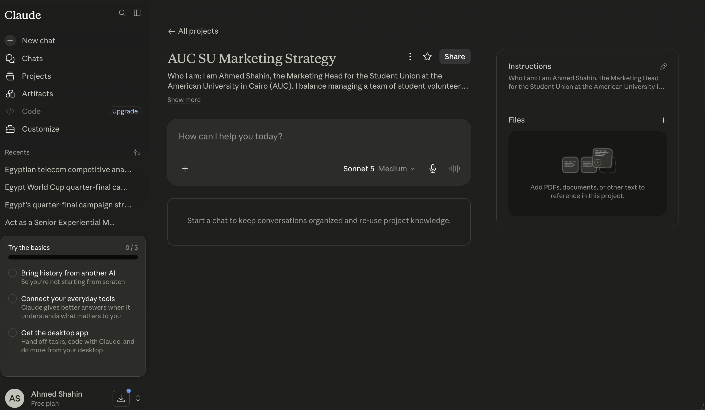

# AI Workflow Audit and Tool Setup (FL-01)

## 1. Workflow Audit

| Task | Category | Rationale |
| :--- | :--- | :--- |
| **1. Drafting weekly SU event promotion emails to the AUC student body** | Delegate to AI with review | AI can write the initial drafts quickly, but I need to inject the SU's authentic student voice. |
| **2. Leading weekly marketing committee meetings with student volunteers** | Just me | Requires empathy, motivation, and hands-on leadership to keep the team engaged. |
| **3. Brainstorming creative themes for the annual SU Welcome Party** | Collaborate with AI | AI helps generate wild, out-of-the-box ideas which my team and I then filter and ground in reality. |
| **4. Analyzing social media engagement metrics (Instagram/TikTok) for recent campaigns** | Delegate to AI with review | AI can summarize the raw stats, but I need to draw the actionable insights for our campus strategy. |
| **5. Pitching sponsorship packages to local brands and cafes around New Cairo** | Just me | High-stakes interpersonal negotiation where reading the room is critical to securing funding. |
| **6. Organizing the shared Google Drive for all marketing assets and photos** | Fully automate | Scripts and tools can automatically sort files by event date and type without manual dragging. |
| **7. Creating the structural outline for the SU's semester marketing strategy document** | Collaborate with AI | AI builds the skeleton, while I fill in the AUC-specific calendar dates and student goals. |
| **8. Formatting budget expense sheets for the SU treasurer** | Fully automate | AI tools and macros can instantly clean and structure the financial data perfectly. |
| **9. Managing conflicts between committee members over creative direction** | Just me | Strictly relies on emotional intelligence, peer mediation, and trust building. |
| **10. Writing basic scripts to bulk-resize event photos for Instagram uploads** | Collaborate with AI | AI writes the boilerplate code, I test it on our actual media files before deploying. |
| **11. Reviewing final poster designs before sending them to the campus print shop** | Just me | Requires a human eye to ensure our SU branding guidelines are perfectly followed. |
| **12. Generating variations of Instagram captions for ticket sales countdowns** | Delegate to AI with review | AI provides 10 options instantly; I pick the best one and add relevant campus hashtags. |

---

## 2. Target Tasks for Automation (FL-02 through FL-04)

### Target Task 1: Drafting weekly SU event promotion emails
- **Success Definition**: The AI consistently writes a clear, exciting 3-paragraph email draft highlighting event logistics that requires less than 5 minutes of my manual editing before broadcasting to the student body.

### Target Task 2: Brainstorming creative themes for the annual SU Welcome Party
- **Success Definition**: The AI generates at least 5 distinct, budget-friendly themes per session tailored to university students, with at least one concept being viable enough to pitch to the SU President.

### Target Task 3: Analyzing social media engagement metrics
- **Success Definition**: The AI accurately synthesizes weekly Instagram/TikTok insights into a quick top-performing content list with zero hallucinations, saving me 2+ hours of manual data entry and math per week.

---

## 3. Claude Project Configuration

**Custom Instructions Used:**
> **Who I am**: I am Ahmed Shahin, the Marketing Head for the Student Union at the American University in Cairo (AUC). I balance managing a team of student volunteers with executing massive campus-wide campaigns and events.
> **Tone Preferences**: Energetic, relatable, and professional but not stiff. Speak like a dynamic student leader—creative, organized, and deeply tuned in to university campus culture.
> **Current Goals**: I am focused on mastering AI workflows to automate tedious tasks like data formatting and caption writing, so I can spend more time on high-level strategy, team motivation, and securing sponsorships.

**Screenshot of Configured Claude Project:**

---

## 4. Toolkit Setup Verification
- [x] Claude account created
- [x] ChatGPT account created
- [x] Anthropic Academy account created
- [x] Enrolled in *AI Fluency: Framework & Foundations* and completed Module 1
