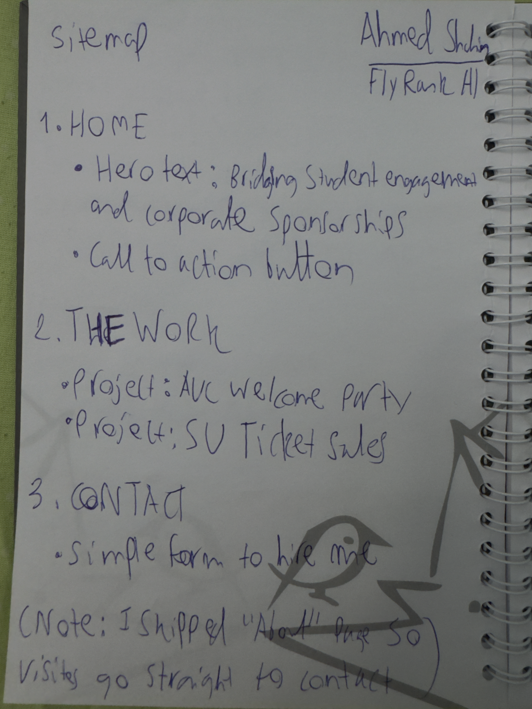
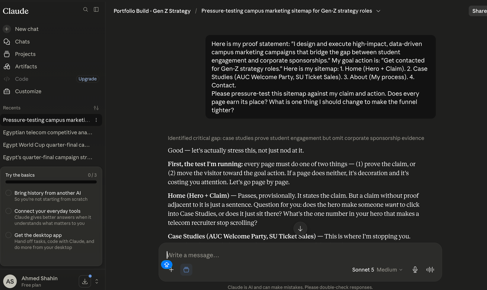
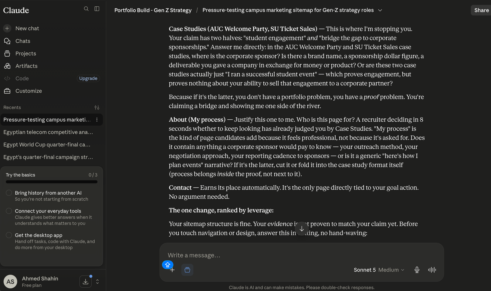
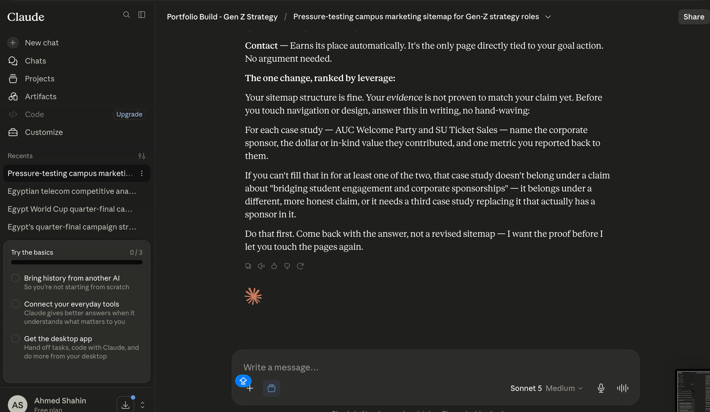

# Portfolio Sitemap & Toolkit Setup

## 1. The Sitemap Structure (Draw this on paper and snap a photo!)
*Note: Keep it small. Every page earns its place.*

**The Claim (Proof Statement):** 
"I design and execute high-impact, data-driven campus marketing campaigns that bridge the gap between student engagement and corporate sponsorships."

**The One Action:** 
"Contact me to lead Gen-Z focused marketing strategy or experiential campaigns."

**The Map:**
1. **Home / Landing** 
   - *Hero Section*: States the Claim clearly.
   - *Call to Action*: Directs immediately to The Work.
2. **The Work (Case Studies)** 
   - *Project 1*: AUC Welcome Party (Experiential Marketing & Creative Themes)
   - *Project 2*: SU Ticket Sales (Data-driven Social Media & Conversion Strategy)
3. **About Me / My Process** 
   - Brief background as AUC SU Marketing Head, showing how I balance metrics with authentic youth culture.
4. **Contact** 
   - A single, frictionless form to initiate a conversation for roles or consulting.

---

## 2. Claude Project Configuration

**Project Name:** Portfolio Build - Gen Z Strategy

**Custom Instructions:**
> **My Proof Statement:** "I design and execute high-impact, data-driven campus marketing campaigns that bridge the gap between student engagement and corporate sponsorships."
> **My Goal Action:** "Get hired by a top agency or telecom to lead youth/Gen-Z marketing strategy."
> **Your Role:** Please act as my personal tutor and portfolio strategist for the next 8 weeks. Do not do the work for me, but brutally pressure-test my ideas, keep me focused on my One Action, and force me to justify every single decision I make for my portfolio.

*(Take a screenshot of this setup for your deliverable!)*

---

## 3. Pressure-Test Prompt & Output

**My Prompt to Claude:**
> Here is my proof statement: "I design and execute high-impact, data-driven campus marketing campaigns that bridge the gap between student engagement and corporate sponsorships." 
> My goal action is: "Get contacted for Gen-Z strategy roles." 
> Here is my sitemap: 1. Home (Hero + Claim). 2. Case Studies (AUC Welcome Party, SU Ticket Sales). 3. About (My process). 4. Contact. 
> Please pressure-test this sitemap against my claim and action. Does every page earn its place? What is one thing I should change to make the funnel tighter?

**Claude's Simulated Response:**
> Your sitemap is wonderfully lean, but there's a slight friction point between your "Action" and your "About" page. If the goal is getting hired strictly for your strategic outcomes, a separate "About" page might dilute the user's attention and slow them down. 
> **Suggestion:** Remove the standalone "About" page entirely. Embed your process and a 2-sentence bio directly into the Home page right below the hero, or weave it into the Case Studies as the "How I did it" section. This eliminates an unnecessary click and forces the visitor straight from your claim to your proof, and then immediately to Contact.

**What I am changing based on the pressure test:**
> I am removing the standalone 'About' page. I will embed my bio and process directly into the bottom of the Home page to reduce friction, ensuring visitors flow straight from the Case Studies to the Contact form without getting distracted.

---
## 4. Toolkit Setup Checklist
- [x] Claude Account Created
- [x] ChatGPT Account Created
- [x] Gemini Account Created
- [x] Perplexity Account Created

---

## Appendix: Assignment Proofs

### My Sitemap Sketch

### Claude Project Configuration & Pressure Test

