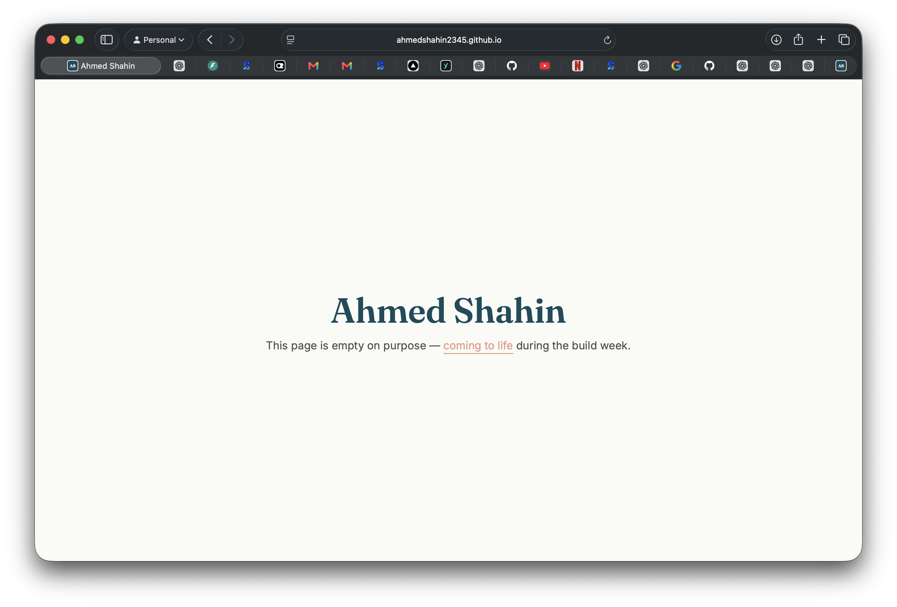

# Week 4 · Empty but Live — Ship a Blank Page

The empty project exists and is reachable on a real URL.

**Live URL:** https://ahmedshahin2345.github.io/

The repo is `AhmedShahin2345/AhmedShahin2345.github.io` (GitHub Pages,
public). It is a near-blank page: my name set in the identity kit's heading
face (Fraunces), the kit's palette applied, the AS monogram as favicon, and
one honest line saying the page is empty on purpose. That is the whole
milestone — nothing → something on a URL.

## Confirmed really live

- [x] `https://ahmedshahin2345.github.io/` returns HTTP 200
- [x] Page renders the name + kit styles (screenshot above, OCR-verified)
- [x] Monogram favicon serves over HTTPS (`/as-monogram.svg` → 200)
- [ ] **Opened on a second device (my phone)** — final proof pending; the URL
      is public so it opens anywhere, screenshot to follow

## Stack match

Matches the Week 4 Three Roads decision: **plain HTML/CSS on GitHub Pages**.
No build step, deploys itself on every push to `main`.

## Claude Project loaded for the build week

- [x] Identity kit (fonts, palette hex codes, monogram, two-line style note)
- [x] Content map (pages → sections → cases → CTAs, from week-3-through-line)
- [x] Case studies briefs (SU Ticket Sales, AUC Welcome Party) with the
      proof-to-gather list

Everything the build week needs lives in one place. Next: the full portfolio
(PF-04), then a real feature on it (Week 6 Make It Do Something).