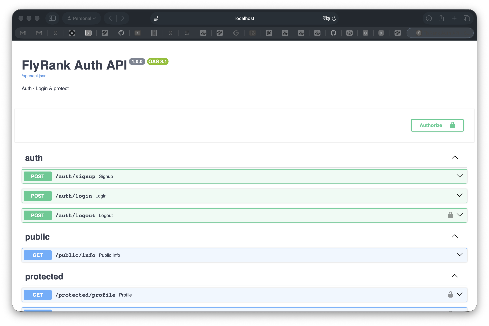

# FlyRank BE-03 · Auth — Login & Protect

A secure FastAPI API with real authentication via **Supabase Auth**. Users can
sign up, log in, and log out; protected routes answer only for verified users
who present a valid JWT in the `Authorization: Bearer <token>` header. The
identity provider stores the accounts and hashes the passwords — my server
never touches a password.

## The trust triangle

```
Client ──credentials──▶ Supabase (IdP)   who you are
Client ◀──JWT────────── Supabase          the pass
Client ──JWT (Bearer)─▶ my server         "is this pass real?" → Supabase
My server ◀──user────── Supabase          verified → open the door
```

## Routes

| Method | Route                  | Auth required | Success | Errors                                    |
|--------|------------------------|---------------|---------|-------------------------------------------|
| POST   | /auth/signup           | no            | 201     | 400 missing email/password                |
| POST   | /auth/login            | no            | 200     | 400 missing fields · 401 bad credentials  |
| POST   | /auth/logout           | yes           | 204     | 401 missing/invalid token                 |
| GET    | /protected/profile     | yes           | 200     | 401 missing/invalid/expired token         |
| GET    | /protected/dashboard   | yes           | 200     | 401 missing/invalid/expired token         |
| GET    | /public/info           | no            | 200     | —                                         |

The auth check is a **reusable FastAPI dependency** (`get_current_user` in
`app/deps.py`) applied to every protected route — one guard, many doors.

## Setup

```bash
cd be-03-auth
python3 -m venv .venv
source .venv/bin/activate
pip install -r requirements.txt
cp .env.example .env        # then fill in your Supabase values
uvicorn app.main:app --port 8000
```

`.env` must contain your **Project URL** and **anon key** from Supabase
Dashboard → Project Settings → API:

```
SUPABASE_URL=https://YOUR-PROJECT.supabase.co
SUPABASE_KEY=YOUR_ANON_KEY
PORT=8000
```

> ⚠️ `.env` is git-ignored. Your keys must never reach GitHub — a `.env.example`
> with placeholder values is committed instead.

The server logs `Server running and connected to Supabase` when it starts.

## Try it

```bash
# public
curl -i http://localhost:8000/public/info

# signup (201)
curl -i -X POST http://localhost:8000/auth/signup \
  -H "Content-Type: application/json" \
  -d '{"email":"test@example.com","password":"password123"}'

# login (200, returns access_token + refresh_token)
curl -i -X POST http://localhost:8000/auth/login \
  -H "Content-Type: application/json" \
  -d '{"email":"test@example.com","password":"password123"}'

# protected (paste your access token)
curl -i http://localhost:8000/protected/profile \
  -H "Authorization: Bearer <PASTE_YOUR_ACCESS_TOKEN_HERE>"

# tamper with one character in the token → 401
```

## Swagger UI

FastAPI serves interactive docs at http://localhost:8000/docs. The protected
routes show the **Authorize** padlock (HTTPBearer security scheme). Click it,
paste a JWT from login, and run `Try it out` on `/protected/profile` from the
browser — no curl needed.



## 401 vs 403

This API returns **401** when the token is missing, malformed, or expired —
"I don't know who you are." I did not add a 403 (Forbidden) route here; 403
would mean "I know exactly who you are, and you still may not" — that's
authorization, a layer the practice project deliberately keeps simple.

## Stage 7 — AI vs me

I asked an AI assistant to build the same secured API (full prompt in
[`ai-version/README.md`](ai-version/README.md)) and kept its answer in
quarantine in [`ai-version/`](ai-version/). I ran my Stage 3 and 4 checkpoints
against it and diffed the code. Three concrete differences:

1. **It left `/protected/dashboard` completely unprotected.** My prompt said
   "protect the /protected routes," but the AI put the token check inside the
   `/protected/profile` handler instead of a reusable dependency, and then
   forgot to add any check to `/dashboard` at all. A request with **no token**
   got **200**. My version uses one `get_current_user` dependency applied to
   both routes — the whole point of middleware reuse. This is the difference
   between a demo and a door that actually closes.

2. **It crashed instead of answering 401/400.** Missing email/password on
   signup raised an uncaught `KeyError` → **500** instead of the contract's
   **400**; a garbage token made `get_user()` raise inside the handler → **500**
   instead of **401**. My version validates input before calling Supabase and
   catches the token-verification error, so both paths return clean JSON with
   the right code.

3. **Token extraction was sloppy.** It used `authorization.replace("Bearer ", "")`
   — a bare token with no prefix, or a header of just `Bearer` with nothing
   after it, both slip through as "valid" tokens instead of being rejected as
   malformed. My dependency checks the header is present and correctly shaped
   before extracting.

**What my prompt forgot to specify:** the exact 400-vs-422 behaviour (FastAPI's
default for a missing body field is 422, not the assignment's 400), the
"no token may ever reach a protected handler" rule, and that the guard must be
a reusable dependency rather than inlined per-route. The AI silently decided
all three for me.

**The rematch:** I improved the prompt (added "extract the token by splitting
the header on the space", "reject 400 when a required field is missing",
"put the guard in one dependency applied to every protected route"). The
regenerated version fixed the middleware reuse and the prefix parsing, but
still returned 422 for missing fields until I spelled that out too — proof that
an AI's output is exactly as good as the specification.

## Requirements checklist

- [x] Server starts on localhost with one documented command
- [x] `.env` used and git-ignored; `.env.example` committed; no keys in git
- [x] POST /auth/signup and POST /auth/login talk to Supabase Auth
- [x] GET /protected/profile extracts and verifies the bearer token via Supabase
- [x] Status codes: 201 signup · 200 login/read · 204 logout · 400 missing input · 401 bad token
- [x] Auth check is a reusable dependency applied to more than one protected route
- [x] Swagger UI at /docs with working Bearer authorization
- [x] Public GitHub repo with meaningful commits and a comprehensive README

## Honest limitation

The full signup → login → protected-call flow can only be exercised with a real
Supabase project (free, no card). With placeholder keys the server starts, the
public route works, validation returns 400, and protected routes return 401 —
but a real user round-trip needs the keys from your own Supabase dashboard.