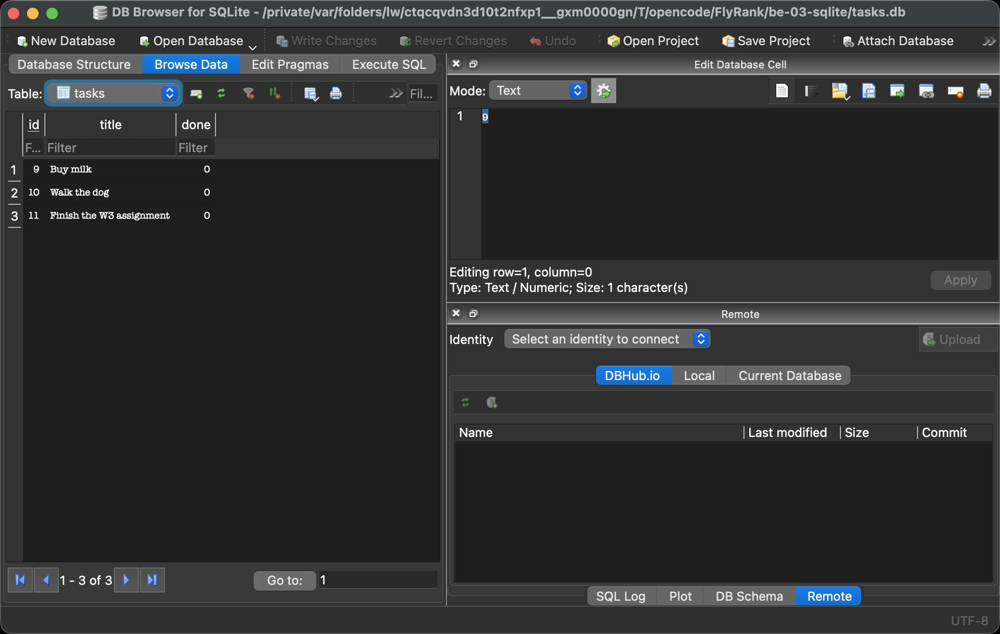

# FlyRank Week 3 · Assignment A2 — Connecting CRUD to the Database

This project takes the in-memory task CRUD API and moves its storage to a real
**SQLite** database. Same five endpoints, same request/response shapes — but
data now survives a server restart.

## Why SQLite?

- **Single file** — the whole database is one file, `tasks.db`. No server to
  install, no configuration, no credentials.
- **Zero setup** — SQLite is built into Python (`sqlite3` is in the standard
  library), so a clean clone runs with just a `pip install -r requirements.txt`.
- **Survives restarts** — in Assignment 1 tasks lived in a Python list and
  vanished on restart. Now they live on disk, so they're still there tomorrow.

## Where the database lives

`tasks.db` sits next to this folder and is **created automatically** the first
time the server starts. The `tasks` table is created automatically too, and
three example tasks are seeded **only when the table is empty** — restarting
never duplicates them. The file is git-ignored (`.gitignore`) so each fresh
clone starts clean and the database builds itself.

## Run it

```bash
pip install -r requirements.txt
uvicorn app.main:app --port 3000
```

Then:

```bash
curl http://localhost:3000/tasks
```

A stranger cloning this repo and running those two commands gets a working API
with its table and three seeded tasks in under 5 minutes.

## Endpoints (identical to Assignment 1)

| Method | Path           | Success | Errors                       |
|--------|----------------|---------|------------------------------|
| GET    | /tasks         | 200     | —                            |
| GET    | /tasks/{id}    | 200     | 404 `{"error":"Task not found"}` |
| POST   | /tasks         | 201     | 400 missing/empty title      |
| PUT    | /tasks/{id}    | 200     | 400 invalid body · 404 unknown id |
| DELETE | /tasks/{id}    | 204     | 404 unknown id               |

All queries use **parameterized placeholders** (`?`) — user input is passed
separately, never glued into SQL strings.

## Example SQL query (Stage 4)

Ran by hand against `tasks.db` — the API reflected the change immediately,
with no restart:

```sql
SELECT COUNT(*) FROM tasks;
```

Returned the number of rows in the table; editing the database by hand and
seeing it through `GET /tasks` proves the API and the file share one source of
truth. More queries in [sql-queries.md](sql-queries.md).

## Database screenshot

The database open in DB Browser for SQLite, showing the seeded tasks:



## Extras

- Search: `GET /tasks?search=milk` — `WHERE title LIKE ?`
- Status filter: `GET /tasks?done=true` — `WHERE done = ?`
- Sorting: `GET /tasks?sort=title` — `ORDER BY title`
- Stats: `GET /stats` — `SELECT COUNT(*)`
- Timestamps: `created_at` / `updated_at` added via `ALTER TABLE`
- Index on `title` to speed up the search extra
- Seeding wrapped in a transaction (all-or-nothing)

### The timestamps migration

Adding `created_at` and `updated_at` to a table that already had rows felt
unnerving — `ALTER TABLE` changed the shape of live data, and SQLite even
refuses a non-constant default, so I had to add the columns and then backfill
existing rows in a second statement. That nervousness is exactly why migrations
exist: changing a table's shape is a real, versioned operation, not an
afterthought.

### The index

`idx_tasks_title` is an index on `tasks(title)`. Without it, every
`WHERE title LIKE ...` search scans the whole table row by row; with it, SQLite
can narrow the lookup quickly. An index is a sorted lookup structure the
database maintains for you so queries find rows faster.

## Stage 6 — AI vs me

I asked an AI assistant to do the same memory-to-SQLite migration, kept its
answer in quarantine in [`ai-version/`](ai-version/), ran it, and diffed it
against my hand-built version. My prompt is in
[`ai-version/README.md`](ai-version/README.md).

The AI version **started on the first try** and created its own `tasks.db`, and
rows I added survived a restart. But testing and the diff exposed real
differences:

**What it did better:** it put everything in one readable file and used
`AUTOINCREMENT` cleanly, and its UPDATE-then-fetch pattern is compact. Its
schema creation was fine on a fresh database.

**What it got wrong or quietly ignored:**

1. **The seed multiplied on every restart.** It inserted the three examples
   unconditionally at import time. Boot 1 had 3 rows; boot 2 had 6. My version
   counts rows first and seeds only when the table is empty.
2. **DELETE returned `200` with `{"deleted": true}`** instead of the A1
   contract's `204` with an empty body. The status-code contract changed
   without anyone asking for it.
3. **An empty title returned `422`, not `400`.** Because it declared
   `title: str` as a required function argument, FastAPI rejected the request
   before my validation could run. The assignment's 400 rule was silently lost.
4. **One query was string-glued SQL.** `GET /tasks/{id}` built the query with
   `f"SELECT * FROM tasks WHERE id = {task_id}"` — exactly the SQL-injection
   pattern the assignment bans. Everything else used `?`, but one slip is all
   an attacker needs.

**What my prompt forgot to specify:** it said "seed three example tasks" but
not *"only when the table is empty"* — the AI chose the eager interpretation.
It also didn't say *"return 204 with an empty body"* or *"400 as a JSON error
for a missing or empty title"*, so the AI quietly decided those for me.

**The rematch:** I rewrote the prompt to add the empty-table seed guard, the
204-on-delete, the exact 400 JSON shape, and "every query must use `?`
placeholders". The regenerated version fixed the seed duplication and the 204,
but still produced 422 for an empty title until I spelled out the validation
step in the prompt — proof that the AI's output is exactly as good as the
specification.
